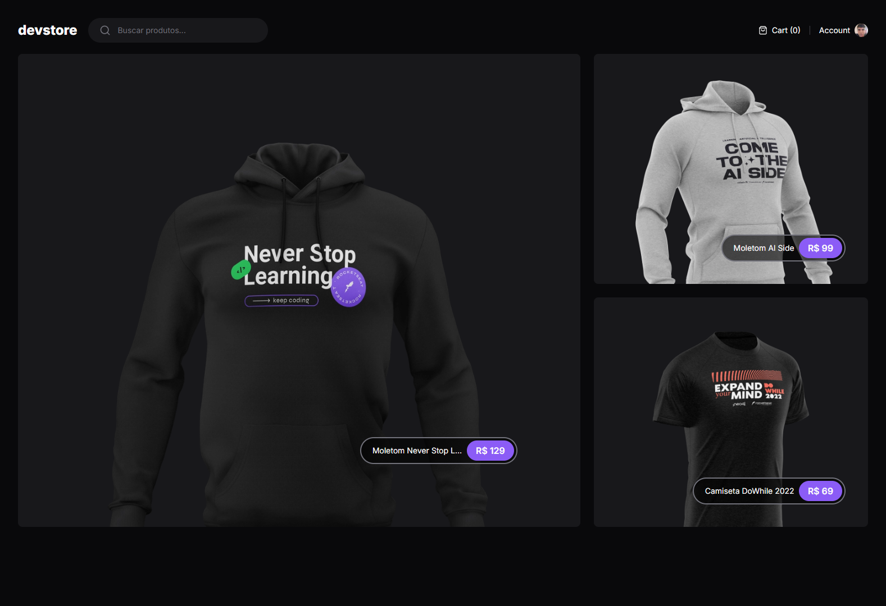

<h1 align="center">devstore</h1>



## Description

Application builded to learn the fundamentals of AppRouter from Next.js. The major concepts here are Server components, Client Components and Streaming SRR.

### Resource

- Partially rendering page on server-side (Streaming SRR).
- Data Fetching with Static and Dynamic params.
- Static and Dynamic Metadata title.
- Dynamic Open graph image.

### Run

```bash
git clone https://github.com/andresilveira1/devstore.git

npm install
```

### HTTP

#### GET 
```http
/products/:slug
```

```http
/products/featured
```

```http
/products/search?q="any reference with product title"
```

<br>

[](https://choosealicense.com/licenses/mit/)